# TabBrain

AI-powered Chrome extension for organizing browser tabs and bookmarks. Uses local or cloud LLMs to intelligently categorize, group, and clean up your browser chaos.

## Quick Start

```bash
npm install
npm run build
```

1. Open `chrome://extensions` in Chrome
2. Enable **Developer mode** (top right toggle)
3. Click **Load unpacked** → select the `dist` folder
4. Click the TabBrain icon to open the side panel
5. Go to **Settings** to configure your LLM provider (Ollama, OpenAI, etc.)


## Cross-Platform Support

TabBrain works on **Windows**, **macOS**, and **Linux** - anywhere Chrome runs.

| Platform | Status | Notes |
|----------|--------|-------|
| Windows | Fully Supported | |
| macOS | Fully Supported | |
| Linux | Fully Supported | |
| ChromeOS | Fully Supported | |

The extension uses standard Chrome Extension APIs that work identically across all platforms. No platform-specific configuration required.

## Features

- **Duplicate Detection** - Find and remove duplicate tabs and bookmarks
- **Window Topic Detection** - AI suggests descriptive labels for each window
- **Tab Categorization** - Automatically categorize tabs (Tech, Shopping, News, etc.)
- **Tab Group Creation** - Create Chrome tab groups based on categories
- **Domain Sorting** - Sort tabs alphabetically by domain
- **Window Merge** - Detect and combine windows with overlapping content
- **Bookmark Organization** - Rename generic folders, find dead links

## Architecture

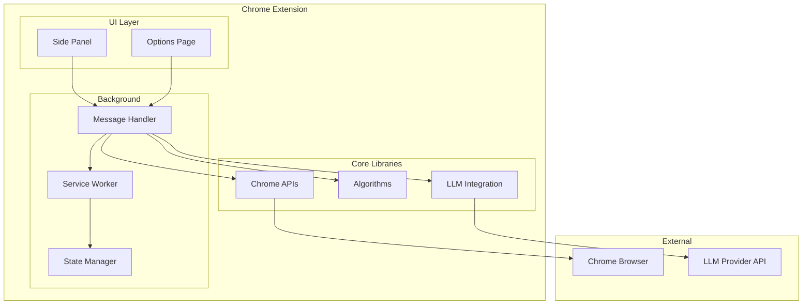

## Data Flow

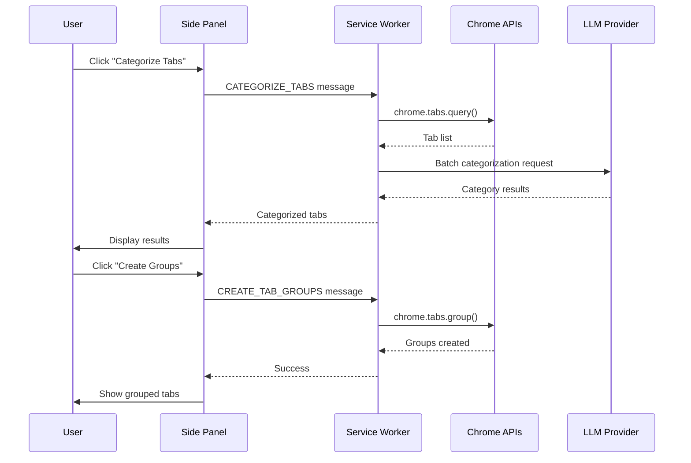

## Project Structure

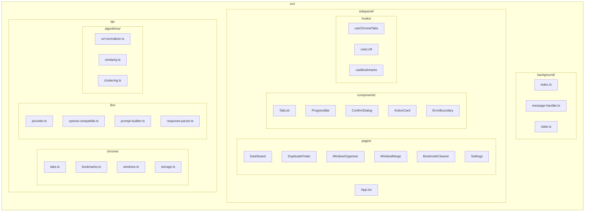

## Quick Start

### Prerequisites

- Node.js 18+
- Chrome/Chromium browser
- (Optional) Local LLM via Ollama or Open WebUI

### Installation

```bash
# Clone the repository
git clone https://github.com/yourusername/tabbrain.git
cd tabbrain

# Install dependencies
npm install

# Build the extension
npm run build
```

### Load in Chrome

1. Open Chrome and navigate to `chrome://extensions`
2. Enable **Developer mode** (toggle in top right)
3. Click **Load unpacked**
4. Select the `dist/` folder from this project
5. Click the TabBrain icon in your toolbar

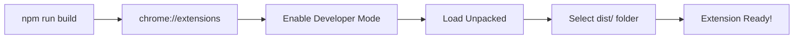

## Configuration

### Setting Up Your LLM Provider

TabBrain supports multiple LLM providers:

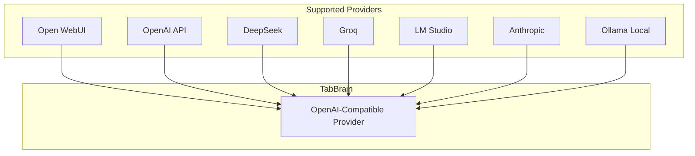

### Configuration Steps

1. Click the **gear icon** in TabBrain's side panel
2. Or right-click extension → **Options**
3. Select your provider and enter details:

| Provider | Base URL | API Key Required |
|----------|----------|------------------|
| Open WebUI | `http://localhost:3000/api` | Yes |
| OpenAI | `https://api.openai.com/v1` | Yes |
| Ollama | `http://localhost:11434/api` | No |
| DeepSeek | `https://api.deepseek.com/v1` | Yes |
| Groq | `https://api.groq.com/openai/v1` | Yes |

### Recommended Models

For best results with small context windows:

| Model | Context | Best For |
|-------|---------|----------|
| Llama 3.1 8B | 8K | Fast categorization |
| Llama 3.1 70B | 32K | Accurate topic detection |
| Qwen 2.5 72B | 32K | Multi-language support |
| Mistral Large | 32K | General purpose |
| GPT-3.5 Turbo | 16K | Cloud fallback |

## Usage Guide

### Finding Duplicates

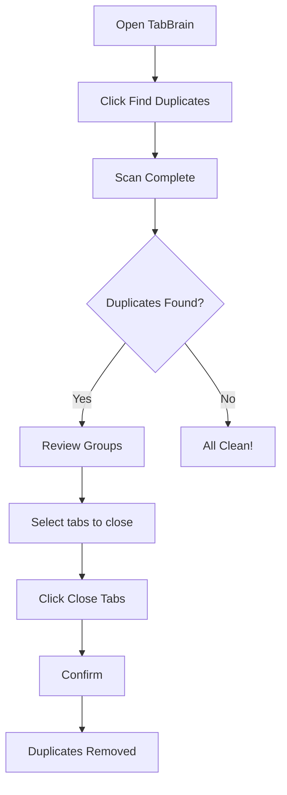

1. Click **Find Duplicates** on the dashboard
2. Review grouped duplicates (first tab is kept by default)
3. Check boxes for tabs you want to close
4. Click **Close X Tabs** and confirm

### Organizing Windows

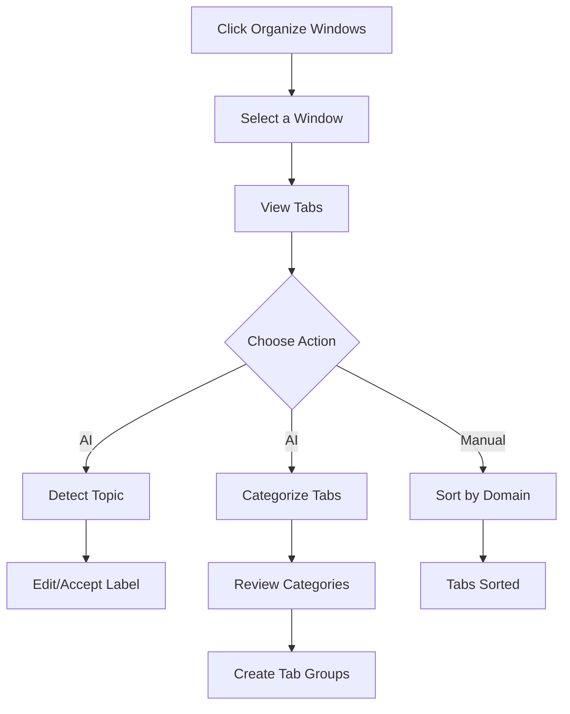

1. Click **Organize Windows** on dashboard
2. Select a window to organize
3. Use **Detect Topic** to get AI-suggested window name
4. Use **Categorize Tabs** to classify each tab
5. Click **Create Tab Groups** to apply Chrome tab groups

### Merging Windows

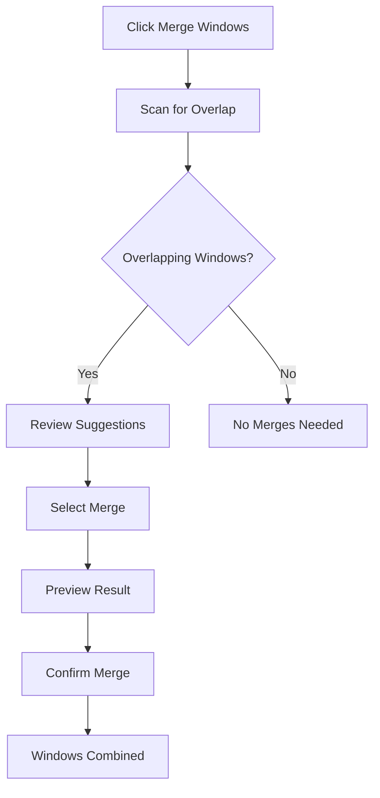

### Cleaning Bookmarks

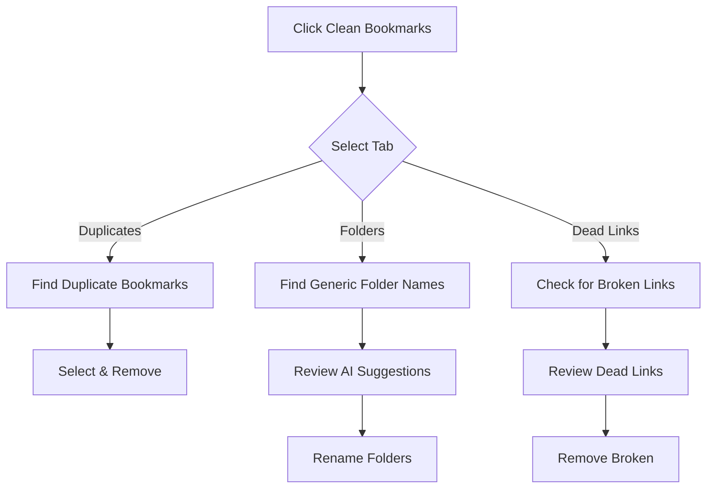

## Development

### Commands

```bash
# Start development server with hot reload
npm run dev

# Type checking
npm run typecheck

# Build for production
npm run build

# Run unit tests
npm run test

# Run tests in watch mode
npm run test:watch

# Run E2E tests
npm run test:e2e

# Run tests in Docker
npm run test:docker
```

### Development Workflow

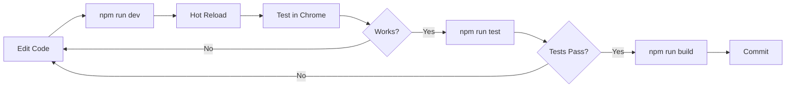

### Project Layout

```
tabbrain/
├── src/
│   ├── background/          # Service worker scripts
│   │   ├── index.ts         # Entry point
│   │   ├── message-handler.ts
│   │   └── state.ts
│   ├── sidepanel/           # Main UI
│   │   ├── App.tsx
│   │   ├── pages/           # Feature pages
│   │   ├── components/      # Reusable components
│   │   └── hooks/           # React hooks
│   ├── options/             # Settings page
│   ├── lib/
│   │   ├── chrome/          # Chrome API wrappers
│   │   ├── llm/             # LLM integration
│   │   ├── algorithms/      # Core logic
│   │   └── utils/           # Helpers
│   └── types/               # TypeScript definitions
├── tests/
│   ├── unit/                # Vitest unit tests
│   └── e2e/                 # Playwright E2E tests
├── public/
│   └── icons/               # Extension icons
├── dist/                    # Build output
├── manifest.json            # Extension manifest
├── vite.config.ts
├── tailwind.config.js
├── Dockerfile
├── docker-compose.yml
├── .github/workflows/ci.yml
└── Jenkinsfile
```

## Testing

### Unit Tests

```bash
npm run test
```

Tests cover:
- URL normalization and tracking parameter removal
- Similarity algorithms (Levenshtein, Jaccard, cosine)
- Duplicate detection and clustering
- Tab sorting logic

### E2E Tests

```bash
npm run test:e2e
```

Tests the extension in a real Chrome browser:
- Extension loading
- Tab creation and manipulation
- Duplicate detection

### Docker Testing

```bash
# Run all tests in container
npm run test:docker

# Or manually
docker-compose up --build test
```

## CI/CD

### GitHub Actions

The project includes a complete CI pipeline:

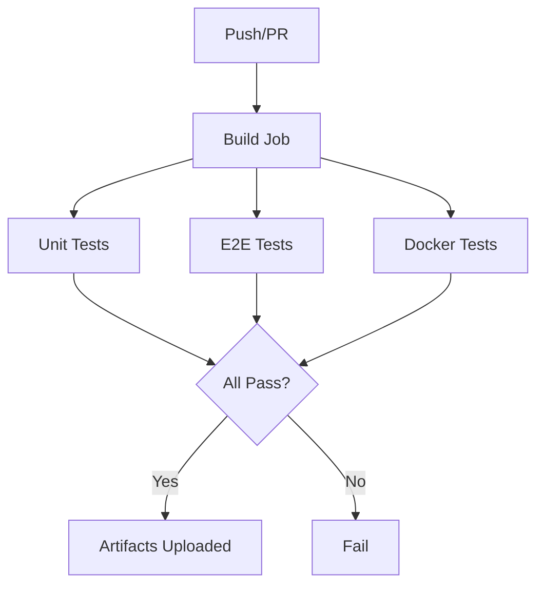

### Jenkins

Alternative Jenkins pipeline available via `Jenkinsfile`.

## Troubleshooting

### Common Issues

| Issue | Solution |
|-------|----------|
| Extension won't load | Check `chrome://extensions` for errors |
| LLM not responding | Verify API URL and key in settings |
| Tabs not grouping | Ensure tabs are in the same window |
| Slow categorization | Reduce batch size or use faster model |

### Debug Mode

Open Chrome DevTools on the side panel to see logs:

1. Right-click side panel → **Inspect**
2. Check Console for `[TabBrain]` messages

## Privacy & Security

- **No data collection** - All processing happens locally or via your configured LLM
- **No page content access** - Only reads tab URLs and titles
- **API keys stored locally** - Never sent to third parties
- **Optional permissions** - Tabs and bookmarks permissions requested on-demand

## Contributing

1. Fork the repository
2. Create a feature branch: `git checkout -b feature/amazing-feature`
3. Make your changes
4. Run tests: `npm run test`
5. Commit: `git commit -m 'Add amazing feature'`
6. Push: `git push origin feature/amazing-feature`
7. Open a Pull Request

## License

MIT License - see [LICENSE](LICENSE) for details.

## Acknowledgments

- Built with [Vite](https://vitejs.dev/) + [CRXJS](https://crxjs.dev/)
- UI powered by [React](https://react.dev/) + [Tailwind CSS](https://tailwindcss.com/)
- Testing with [Vitest](https://vitest.dev/) + [Playwright](https://playwright.dev/)
